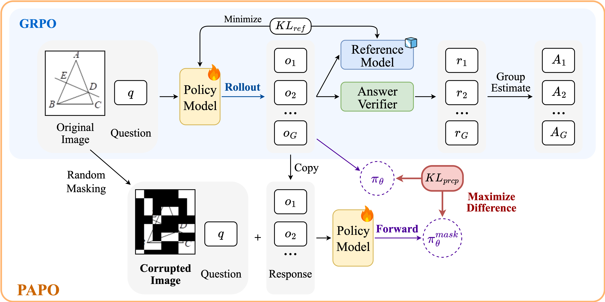
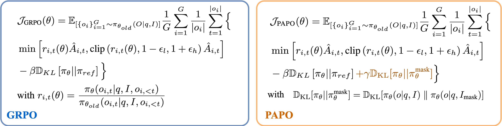
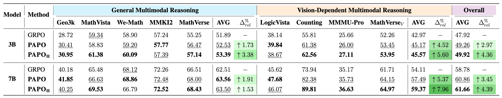

<div align="center">

# **PAPO: Perception-Aware Policy Optimization for Multimodal Reasoning**

</div>

<div align="center">

[](https://mikewangwzhl.github.io/PAPO)
[](https://arxiv.org/abs/2507.06448)
[](https://github.com/mikewangwzhl/PAPO)
[](https://huggingface.co/collections/PAPOGalaxy/papo-qwen-686d92dd3d43b1ce698f851a)
[](https://huggingface.co/collections/PAPOGalaxy/data-686da53d67664506f652774f)

</div>

**PAPO** is a simple yet effective extension of GRPO that encourages visually grounded reasoning. By introducing an Implicit Perception Loss that relies entirely on internal supervision signals, PAPO demonstrates consistent improvements in multimodal reasoning.

## 🌟 **Key Highlights**

- **4.4% overall improvement** on diverse multimodal benchmarks
- **8.0% improvement** on tasks high vision-dependentcy  
- **30.5% reduction** in perception errors
- **No additional data or external reward models** required
- Serves as a **direct drop-in replacement** for GRPO

## 📖 **Methodology**

### **Perception Bottleneck**

We identified that **67% of errors** in current multimodal reasoning models stem from poor perception rather than logical reasoning failures.

<div align="center">

</div>

### **PAPO Algorithm**

**PAPO** extends GRPO by adding an **Implicit Perception Loss** that maximizes the KL divergence between model outputs on original vs. corrupted (masked) images:

<div align="center">

</div>

The core intuition is that a well-behaved multimodal model should produce significantly different outputs when visual information is corrupted, indicating reliance on meaningful visual content.

<div align="center">

</div>

### **Main Results**

PAPO consistently outperforms GRPO across all benchmarks, with particularly pronounced improvements on vision-dependent tasks:

<div align="center">

</div>

#### **PAPO + Remove Reference KL**

PAPO is highly compatible with removing the reference KL penalty, achieving further improvements:

<div align="center">

</div>

## 📊 **Data**

We adapt multiple multimodel reasoning benchmarks to construct our training and evaluation datasets.

### **Training Data**

- **Training**: We adapt [TIGER-Lab/ViRL39K](https://huggingface.co/datasets/TIGER-Lab/ViRL39K) for training. The processed dataset can be found at: [PAPOGalaxy/PAPO_ViRL39K_train](https://huggingface.co/datasets/PAPOGalaxy/PAPO_ViRL39K_train).
- Validation (optional): We use the testset from [MMK12](https://huggingface.co/datasets/FanqingM/MMK12) for validation during training. **Note that this is solely for monitoring, we do not pick checkpoints based on this.** The processed dataset can be found [PAPOGalaxy/PAPO_MMK12_test](https://huggingface.co/datasets/PAPOGalaxy/PAPO_MMK12_test).

### **Evaluation Data**
We adapted 8 different multimodal reasoning benchmarks to evaluate **PAPO**, which are further identify two groups, including `General Multimodal Reasoning` and `Vision-Dependent Multimodal Reasoning`:
- **General Reasoning**
    - `hiyouga/geometry3k`: [Hugging Face Dataset](https://huggingface.co/datasets/hiyouga/geometry3k), [Data Source](https://github.com/lupantech/InterGPS)
    - `AI4Math/MathVista`: [Hugging Face Dataset](https://huggingface.co/datasets/AI4Math/MathVista)
    - `We-Math/We-Math`: [Hugging Face Dataset](https://huggingface.co/datasets/We-Math/We-Math)
    - `FanqingM/MMK12`: [Hugging Face Dataset](https://huggingface.co/datasets/FanqingM/MMK12)
    - `AI4Math/MathVerse`: [Hugging Face Dataset](https://huggingface.co/datasets/AI4Math/MathVerse)
- **Vision-Dependent Reasoning**
    - `lscpku/LogicVista`: [Hugging Face Dataset](https://huggingface.co/datasets/lscpku/LogicVista)
    - `BUAADreamer/clevr_count_70k`: [Hugging Face Dataset](https://huggingface.co/datasets/BUAADreamer/clevr_count_70k)
    - `MMMU/MMMU_Pro`: [Hugging Face Dataset](https://huggingface.co/datasets/MMMU/MMMU_Pro)
    - `MathVerse_V` (vision-dependent subset): Adapted from [AI4Math/MathVerse](https://huggingface.co/datasets/AI4Math/MathVerse)

All results in the paper are average accurarcy @ 8 (repeating 8 times), with a temperature set to 1.0.

## 🚀 **Quick Start**

### **Environment Setup**

#### **Option 1: All-in-one Installation Script**
```bash
conda create -n papo python=3.10
conda activate papo

cd PAPO
bash scripts/install.sh
```

#### **Option 2: Using pip**
```bash
pip install -e .
```

### **Training**

The main training pipeline is adopted from [EasyR1](https://github.com/hiyouga/EasyR1). We support training with different configurations for both `Qwen2.5-VL 3B` and `7B` models:
- **Qwen2.5-VL 3B:** We typically use 2 `80G H100` GPUs
- **Qwen2.5-VL 7B:** We typically use 4 `80G H100` GPUs

#### **GRPO Baseline**
```bash
# 3B model
cd PAPO
bash examples/qwen2_5_vl_3b_grpo.sh

# 7B model  
cd PAPO
bash examples/qwen2_5_vl_7b_grpo.sh
```

#### PAPO (γ = 0.01)
```bash
# 3B model
cd PAPO
bash examples/qwen2_5_vl_3b_papo.sh

# 7B model  
cd PAPO
bash examples/qwen2_5_vl_7b_papo.sh
```

#### PAPO_H (γ = 0.02)
```bash
# 3B model
cd PAPO
bash examples/qwen2_5_vl_3b_papo_high.sh

# 7B model (with double entropy loss)
cd PAPO
bash examples/qwen2_5_vl_7b_papo_high.sh
```

#### PAPO + No Reference KL
```bash
# 3B model (with double entropy loss)
cd PAPO
bash examples/qwen2_5_vl_3b_papo_no_kl_ref.sh

# 7B model (with double entropy loss)
cd PAPO
bash examples/qwen2_5_vl_7b_papo_no_kl_ref.sh
```

### **Pretrained Checkpoints**

A collection of 7B/3B pretrained checkpoints on ViRL39K can be downloaded from [here](https://huggingface.co/collections/PAPOGalaxy/papo-qwen-686d92dd3d43b1ce698f851a). The checkpoints follows Qwen2.5-VL Huggingface format, which can be inferenced as drop-in replacement to https://huggingface.co/Qwen/Qwen2.5-VL-7B-Instruct. 

### **Performance Evaluation**

To run model inference and evaluation, we integrate the evaluation submodule located at `PAPO/PAPO-Eval`.
Detailed instructions for running inference and evaluation can be found in [PAPO-Eval](https://github.com/xhguo7/PAPO-Eval).
```bash
# Navigate to PAPO evaluation submodule
cd PAPO-Eval

# Data preprocessing
bash papo_eval/preprocess/preprocess.sh

# Run model inference
bash papo_eval/run_infer.sh

# Run model evaluation
bash papo_eval/run_eval.sh
```

## 🥰 Acknowledgements

We thank the [EasyR1](https://github.com/hiyouga/EasyR1) team for providing the foundational codebase that we adapted to implement PAPO. Our implementation builds upon their efficient RLVR framework and extends it with perception-aware optimization methodologies. We also acknowledge the open-source community for providing the datasets and evaluation benchmarks that made this research possible.

## 📝 Citation

```bibtex
@article{wang2025perception,
  title={Perception-Aware Policy Optimization for Multimodal Reasoning},
  author={Wang, Zhenhailong and Guo, Xuehang and Stoica, Sofia and Xu, Haiyang and Wang, Hongru and Ha, Hyeonjeong and Chen, Xiusi and Chen, Yangyi and Yan, Ming and Huang, Fei and others},
  journal={arXiv preprint arXiv:2507.06448},
  year={2025}
}
```

## 📄 License

This project is licensed under the MIT License - see the [LICENSE](LICENSE) file for details.

---

<div align="center">

**Learning to perceive while learning to reason!**

[🌐 Project Page](https://mikewangwzhl.github.io/PAPO)  |  [📄 Paper](https://arxiv.org/abs/2507.06448)  |  [💻 GitHub](https://github.com/mikewangwzhl/PAPO)  |  [🤗 Models](https://huggingface.co/collections/PAPOGalaxy/papo-qwen-686d92dd3d43b1ce698f851a)  |  [🤗 Data](https://huggingface.co/collections/PAPOGalaxy/data-686da53d67664506f652774f)

</div>